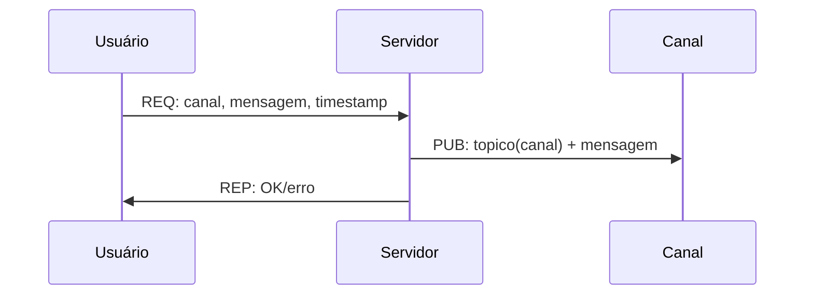

# Projeto de Sistemas Distribuídos

Este é um projeto com arquitetura cliente-servidor que implementa os padrões de comunicação **Publish-Subscribe (Pub/Sub)** e **Request-Reply**.

Como o projeto está sendo desenvolvido individualmente, os componentes foram implementados em linguagens de programação diferentes:

- **Cliente:** C#
- **Servidor / Broker:** Python

---

## Parte 2 - Publicacao em canais com Publisher-Subscriber

Esta etapa adiciona publicacao em canais (topicos) com separacao entre:

- **Broker Req-Rep** para trafego cliente <-> servidor.
- **Proxy Pub/Sub** dedicado para distribuicao de mensagens em canais.

## Arquitetura de comunicacao

### Req-Rep (solicitacao e resposta)

- Cliente envia requisicoes para o broker na porta **5555**.
- Broker encaminha para o servidor pela porta **5556**.
- Servidor processa a acao e responde ao cliente pelo mesmo fluxo.

## Publicacao em canais

O fluxo de publicacao segue o modelo abaixo:

Processo:

1. O cliente envia ao servidor o canal e a mensagem.
2. O servidor valida se o canal existe.
3. Se valido, publica no topico correspondente via proxy Pub/Sub.
4. O servidor retorna ao cliente o status da publicacao.

Assim, o cliente sabe imediatamente se a publicacao foi aceita ou rejeitada.

## Persistencia em disco

O servidor persiste dados localmente em disco no diretorio `entidades/`, utilizando serializacao com pickle (`.pkl`).

Dados persistidos:

- Usuarios cadastrados
- Canais criados
- Mensagens publicadas

Essa estrategia permite recuperar o estado apos reinicializacao do servico.
